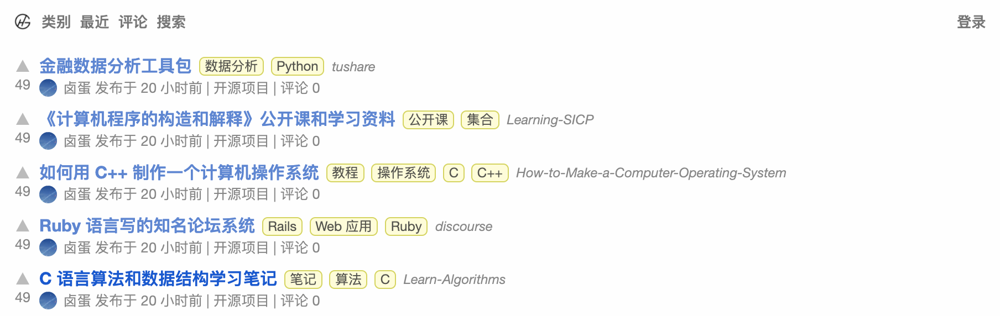

<p align="center">
  
  <br>此项目为 <a href="https://hellogithub.com">HelloGitHub.com</a> 官网源码
  <br>HelloGitHub 分享 GitHub 上有趣、入门级的开源项目。
</p>

<p align="center">
  <a href="https://cdn.jsdelivr.net/gh/521xueweihan/img_logo@main/logo/weixin.png"></a>
  <a href="https://github.com/521xueweihan/hellogithub.com/stargazers"></a>
  <a href="https://github.com/521xueweihan/hellogithub.com/issues"></a>
    <a href="https://weibo.com/hellogithub"></a>
</p>


## 简介

本项目采用：Python + Flask + MySQL + Redis 构建。 



既然网站内容是开源项目推荐，那么索性就把代码也开源了。 重构中...

## 运行

1. 下载：`git clone git@github.com:521xueweihan/hellogithub.com.git`
2. 部署环境：切换到项目目录，执行 `poetry install` 安装依赖
3. 运行：
    - 第一种：`poetry run flask run`
    - 第二种：`poetry run python run.py`
    
## 项目结构
```
├── README.md
├── config.py
├── doc
│   ├── hellogithub.gif
│   └── log.md
├── poetry.lock
├── pyproject.toml
├── run.py
└── website
    ├── __init__.py
    ├── home.py
    ├── static
    │   └── css
    │       └── index.css
    └── templates
        └── index.html
```

## 声明

<a rel="license" href="https://creativecommons.org/licenses/by-nc-nd/4.0/deed.zh"></a><br>本作品采用 <a rel="license" href="https://creativecommons.org/licenses/by-nc-nd/4.0/deed.zh">署名-非商业性使用-禁止演绎 4.0 国际</a> 进行许可。

<a href="mailto:595666367@qq.com">联系我</a>


<p align="center">
  
</p>